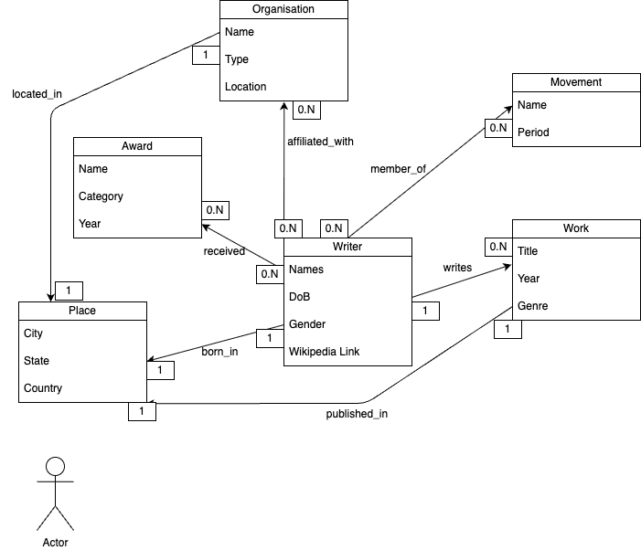

# AfricanAmericanLit

 This repository is part of a University project in Digital Humanities.

## Conceptual Model (Draft)

Vector source (.drawio): (Documentation/MCD_AfAm.drawio)
Image preview:  

See detailed semantics: [MCD documentation](Documentation/MCD_documentation.md)
